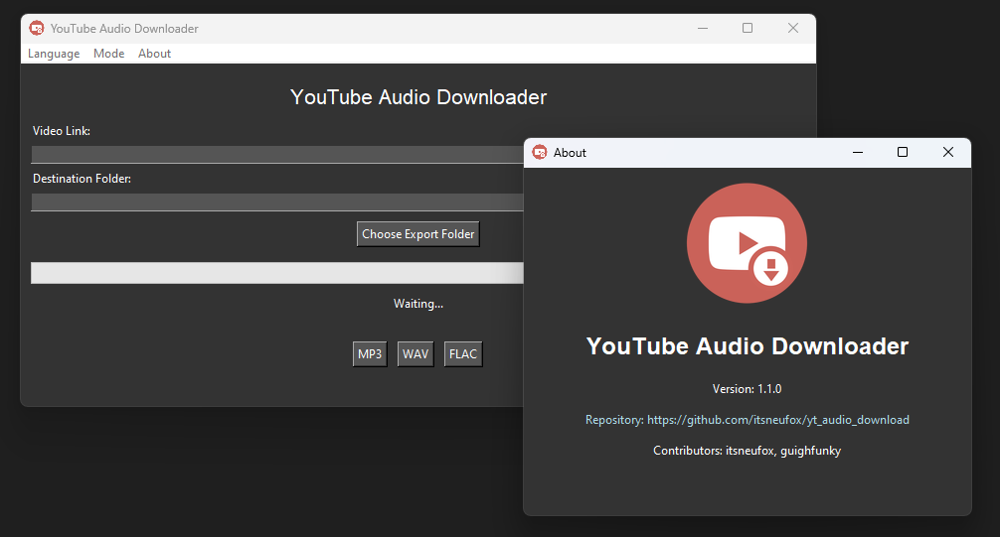

# 🎵 YouTube Audio Downloader (YAD)

A simple GUI application for downloading audio from YouTube videos and converting it to various formats. This application uses `yt-dlp` for downloading and `ffmpeg` for audio conversion.

<p align="center">
  
</p>

## 📋 Table of Contents

- [Features](#features)
- [Requirements](#requirements)
- [Installation](#installation)
  - [Install Dependencies](#install-dependencies)
  - [Bundling ffmpeg and ffprobe](#bundling-ffmpeg-and-ffprobe)
- [Usage](#usage)
- [Contributing](#contributing)
- [License](#license)
- [Credits](#credits)

## 🚀 Features

- Download audio from YouTube videos.
- Convert audio to MP3, WAV or FLAC formats.
- Progress bar showing download and conversion status.
- Dark and light mode toggle.
- GUI-based file and folder selection.
- Multilingual support.

## 🛠️ Requirements

- Python 3.6+
- `yt-dlp`
- Bundled `ffmpeg` and `ffprobe` for audio processing

## 📥 Installation

### Install Dependencies

1. **Clone the repository**:

    ```bash
    git clone https://github.com/itsneufox/yt_audio_download.git
    cd yt_audio_download
    ```

2. **Install Python dependencies**:

    Create a `requirements.txt` file in your project directory with the following content:

    ```
    yt-dlp
    ```

    Install the dependencies using pip:

    ```bash
    pip install -r requirements.txt
    ```

### Bundling ffmpeg and ffprobe

1. **Download ffmpeg and ffprobe**:

    - Download the executables from [FFmpeg Official Site](https://ffmpeg.org/download.html) and extract them.

2. **Include ffmpeg and ffprobe in your project**:

    - Create a directory in your project folder named `ffmpeg/` and place `ffmpeg.exe` and `ffprobe.exe` inside it.

    Example folder structure:

    ```
    yt_audio_download/
    ├── ffmpeg/
    │   ├── ffmpeg.exe
    │   └── ffprobe.exe
    ├── ico/
    │   └── icon.ico
    ├── app.py
    ├── requirements.txt
    └── README.md
    ```

3. **Build the application using PyInstaller**:

    To build the application with or without a terminal window, use the following commands:

    - **With Terminal Window:**

        ```bash
        pyinstaller --clean --onefile --add-data "ico/icon.ico;ico" --add-data "ico/icon.png;ico" --add-data "ffmpeg/ffmpeg.exe;ffmpeg" --add-data "ffmpeg/ffprobe.exe;ffmpeg" --icon="ico/icon.ico" app.py
        ```

    - **Without Terminal Window:**

        ```bash
        pyinstaller --clean --onefile --windowed --add-data "ico/icon.ico;ico" --add-data "ico/icon.png;ico" --add-data "ffmpeg/ffmpeg.exe;ffmpeg" --add-data "ffmpeg/ffprobe.exe;ffmpeg" --icon="ico/icon.ico" app.py
        ```

    This command ensures that `ffmpeg` and `ffprobe` are included in the executable and sets the application icon. The `--windowed` option is used to build a GUI-only application without a terminal window.

## 🎬 Usage

1. **Run the application**:

    - **If you didn't generate an executable run:**

        ```bash
        python app.py
        ```
        
    - **If you generated an executable just run the generated executable.**
      

2. **Enter the YouTube video link** and select the destination folder where you want to save the audio file.

3. **Click in any file format** to start the download and conversion process.

4. **Monitor the progress** using the progress bar and status label.

5. **Toggle between light and dark modes** using the mode button.

6. **Switch languages** using the language buttons.

## 🤝 Contributing

Contributions are welcome! Please fork the repository, make your changes, and submit a pull request.

## 📝 License

This project is licensed under the MIT License - see the LICENSE.txt file for details.

## 🎖️ Credits

This project is based on the work of [guighfunky](https://github.com/guighfunky) from the repository [baixador_audio_yt](https://github.com/guighfunky/baixador_audio_yt).

Be warned that the original code [was generated on ChatGPT](https://x.com/funkyblackcat/status/1794527287343276539)
